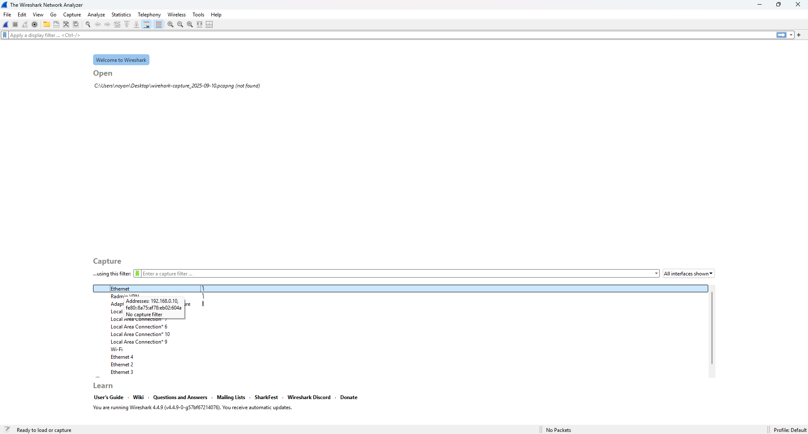
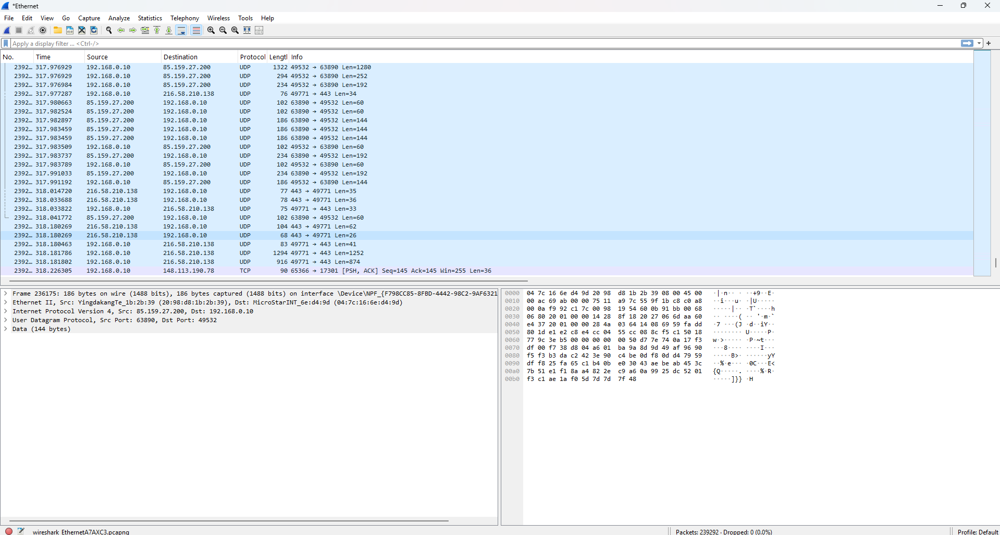
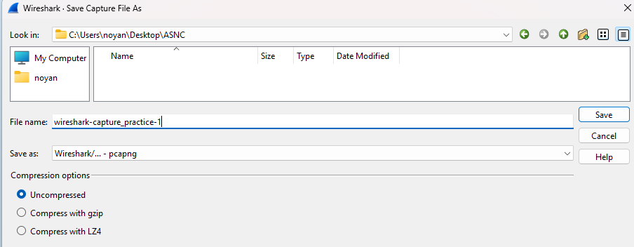
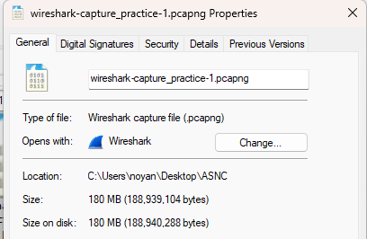
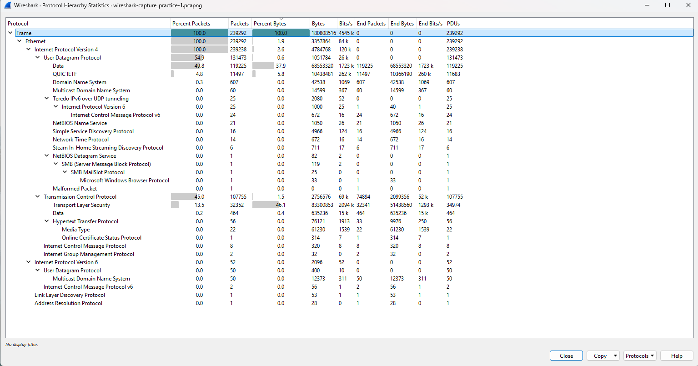

# practice-1
1. Topic: network traffic analysis via packets capturing and detection of anomalies / possible attacks
- capturing and analyzing network traffic
- identifying normal communication patterns
- detecting possible anomalies or malicious activities
- using professional networking tools

## Solution and practice
1. Installed and configured Wireshark in Windows (winget install WiresharkFoundation.Wireshark)
- source code: https://gitlab.com/wireshark/wireshark
- Wireshark in CLI form: tshark, tcpdump, or alternative
- However, Wireshark depricated native Python binding / API for interaction (reference: https://wiki.wireshark.org/python)
  - it is possible to use Lua (https://wiki.wireshark.org/lua)
  - that is why, downloaded additional library: pyshark (https://github.com/KimiNewt/pyshark)
  - network adapter need to be set in promiscuous mode for proper packat capture
2. setup environment for analysis:
```
python3 -m venv venv
source .venv/bin/activate
pip install -r requirements.txt
```
3. Captured traffic from Windows machine for 5+ minutes with web browsing, file downloads, DNS requests, VPN connection, etc.
  - or download traffic sample like https://www.wireshark.org/resources#sample-captures
  - saved file in .pcap format in `/local_data`
  - analyzed protcols: most frequent protocols in captured data in summary table (protocol / percentage of traffic)
    - "wireshark" -> "statistics" -> "protocol hierarchy"
  - 
  - 
  - 
  - 
  - 
  - 
4. Anomaly and attack detection
  - detecting possible anomalies in the traffic (e.g., repeated failed DNS requests, ARP spoofing attemps, unusual port scanning activity)
  - suspicious flows with malicious activity
  - provided practical graph representation in main.py to identify connections
  - TODO: place html_figure here

