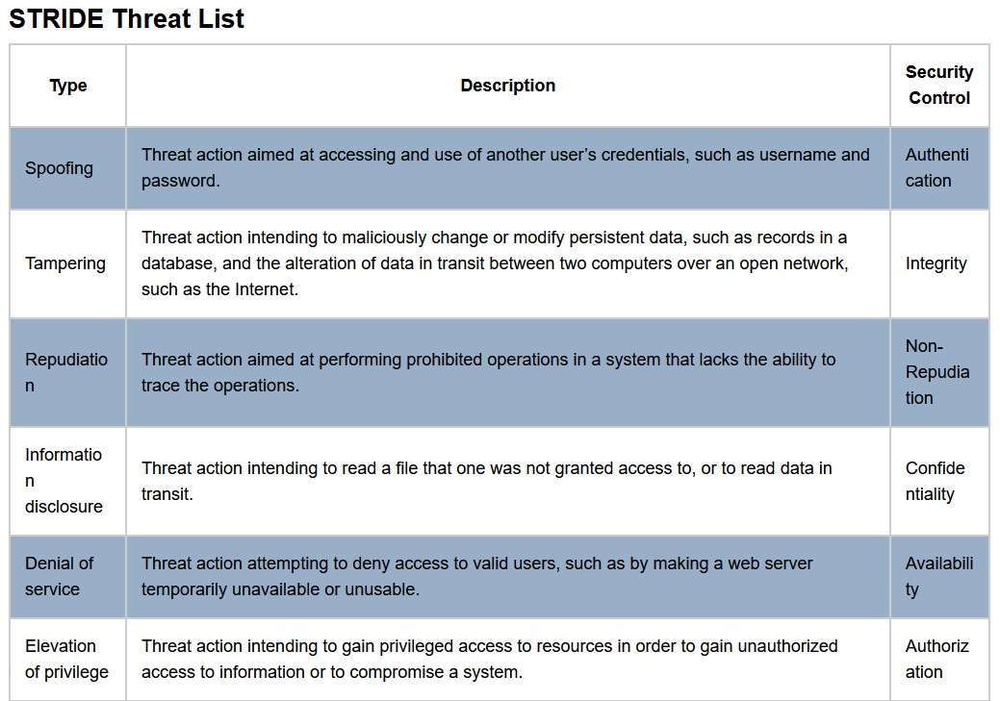
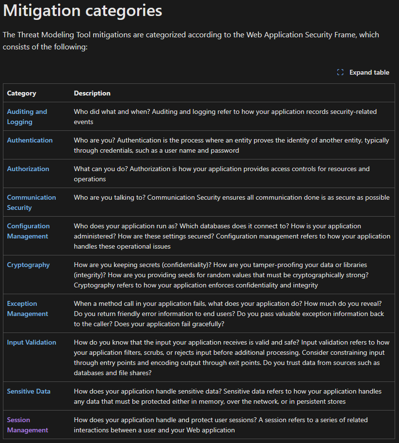

# practice-2
Student: Tendikov Noyan Maratovich\
Group: SSE-2401\
Assignment: https://lms.astanait.edu.kz/mod/assign/view.php?id=5514\
\pagebreak

## Description and theory
1. [STRIDE](https://en.wikipedia.org/wiki/STRIDE_model) - the model / framework for security attack surface modeling and risk management made by Microsoft.
  It identifies different categories of threats and their security controls / mitigation: spoofing, tampering, repudiation, information disclosure, denial of service, elevation of privilage. 
  
  
  
  Alternatives: [PASTA (Process fot Attack Simulations and Threat Analysis)](https://researchp.cs.wisc.edu/mist/SoftwareSecurityCourse/Chapters/2_5-PASTA-ThreatModeling.pdf) according to Risk Centric Threat Modeling book, [DREAD](https://en.wikipedia.org/wiki/DREAD_(risk_assessment_model)), CIA, CIADIE, LINDDUN, PLOT4ai, etc.
  
  Additional sources and resources:
    - https://owasp.org/www-community/Threat_Modeling_Process
    - https://learn.microsoft.com/en-us/azure/security/develop/threat-modeling-tool-mitigations
    - https://cheatsheetseries.owasp.org/cheatsheets/Threat_Modeling_Cheat_Sheet.html
    - Standards: NIST SP 800-30 (Risk Assessment), NIST SP 800-53 (Security Controls), ISO/IEC 27005 (Risk Management).
2. [Data Flow Diagram](https://en.wikipedia.org/wiki/Data-flow_diagram) - notation for designing diagrams of business processes, but also applied well in [threat modeling](https://en.wikipedia.org/wiki/Threat_model).
  - It provides a high-level understanding of the available resources and the direction of data. The main elements of DFD: entities / actors, processes, data stores, and data flows. 
  - Similarly to [C4 model](https://en.wikipedia.org/wiki/C4_model), there are different levels of visualization (usually from 0 to 1, or even multi-level).
  - Various tools are used for visualization: Microsoft Threat Modeling Tool, OWASP Threat Dragon, draw.io, pseudocode, etc.

## Solution and practice
1. System scope, description, and overview
- Given [PyPI](https://pypi.org/) platform that hosts large amount of different Python packages. Similar systems in the category of [software repositories](https://en.wikipedia.org/wiki/Software_repository) are Maven Central, NPM, Crates.io, and many others.
- Source code and documentation: https://github.com/pypi/warehouse/
- Overall, the analysis was broken down into single features rather than the entire product at once. In addition, some elements and details were omitted (assumptions and presumptions were made), since not all architectural aspects of the systems are always known to us. In other words, it is not always possible to work with a white-box approach - sometimes we have to deal with black-box systems, where the specific technologies are unknown, which implies that we only have a high-level representation (focus on specification and general details rather than implementation and specific details). Overdetailing requires additional time and resources (and is more suitable for reverse engineering), but in threat modeling the primary objective is to obtain a representation model that is sufficient enough.

2. Data flow diagrams
- Firstly, we constructed level 0 DFD, as shown in image 3
- Secondly, based on level 0 we dig in details and for each feature provided subdiagrams of level 1 DFD

3. STRIDE analysis
mirrors as threats
For each DFD element (process, flow, data store, entity), perform STRIDE analysis: Spoofing, Tampering, Repudiation, Information disclosure, Denial of Service, Elevation of privilege.
For each identified threat, document:
short description,
potential attack vectors / prerequisites,
associated DFD element,
likelihood (H/M/L) and impact (H/M/L).
Deliverable: a STRIDE table, e.g.:
DFD Element | STRIDE Category | Threat Description | Attack Vector | Likelihood | Impact
https://peps.python.org/pep-0449/

4. Attack scenario (Kill Chain / MITRE ATT&CK)
Select 1–2 high-risk threats from the STRIDE analysis. (detailed attack scenarios)
Expand them into a detailed attack scenario using either:
Lockheed Martin Cyber Kill Chain (Recon → Weaponization → Delivery → Exploitation → Installation → C2 → Objectives), or
MITRE ATT&CK tactics/techniques (with IDs if possible).
For each step, specify: attacker goal, techniques used, possible Indicators of Compromise (IoCs), and detection opportunities.
Example Scenarios
Phishing campaign → stolen admin credentials → lateral movement → database exfiltration.
Insecure CI/CD pipeline → malicious code injection → supply-chain compromise
MITRE ATT&CK Framework: https://attack.mitre.org/
MITRE D3FFENSE Framework: https://d3fend.mitre.org/
CWE List: https://cwe.mitre.org/data/index.html
systematic threat and attack modeling at the system architecture level:
model the attack lifecycle using Kill Chain, justify the scenario’s
plausibility, assess risks, and propose technical and organizational countermeasures.
Corporate web application with API and database.
Cloud environment (Kubernetes containers with microservices).

5. Risk assessment, mitigation and counter measures
Assess each scenario’s risk using a simple matrix: Risk = Likelihood × Impact (H/M/L).
Propose technical controls (MFA, WAF, segmentation, TLS 1.3, patches) and organizational measures (policies, awareness training, logging).
For each measure, explain (justifications): expected risk reduction, implementation effort, and validation metrics.
Risk assessment matrix
Recommendations for monitoring and detection.
Countermeasures and implementation plan.
