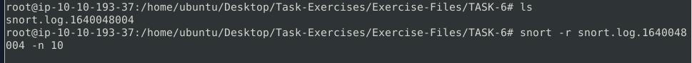

# practice-5
## Description
Student: Tendikov Noyan Maratovich
Group: SSE-2401
Topic: Deployment and testing IDS/IPS
Course: Advanced Computer Networks Security, Practice 5
Link: https://lms.astanait.edu.kz/mod/assign/view.php?id=5986

Objectives: 
- Understand principles of IDS/IPS.
- Gain experience with IDS/IPS tools: Snort, Suricata, etc.
- Analyze IDS/IPS logs under different generated traffic scenarios in simulated environment.
- Setup and configure such tools.
- Customization and validation of IDS/IPS rules for anomaly/attack detection.

Courses:
<!--TODO: idsevasion and working-with-idsips-->
- https://tryhackme.com/room/snort
- https://academy.hackthebox.com/course/preview/working-with-idsips
- https://tryhackme.com/room/idsevasion

Additional references:
- https://www.securitylearninghub.com/#!snort.md
- https://wikival.bmstu.ru/doku.php?id=%D1%81%D0%B5%D1%80%D0%B2%D0%B8%D1%81_snort

## Theory
<!--TODO: Google docs-->
Network Security Monitoring (NSM) - processes / operations of identification potential threats and mitigating their impact, usually being implemented by applying specialized systems (in form of physical devices or software applications).

<!-- TODO: IDS/IPS works с комбинацией firewall, anti-virus, or authorisation system may prevent certain activity from occurring on or against IT assets.-->
[Intrusion Detection System (IDS)](https://en.wikipedia.org/wiki/Intrusion_detection_system) - passively monitors/detects activities/patterns in network or system for potentially malicious ones, suspicious events, abnormal incidents, and policy violations. For example, checking packets for different traces of: malware command and control, exploitation tools, scanning, data exfiltration, contact with phishing sites, corporate policy violation, etc. IDS is responsible for generating reports and alerts when intrusion occurs or signature identified. Then this data can be forwarded futher up the security chain to management station of blue team which has Security Information and Event Management (SIEM) systems/platforms (e.g., Splunk, ELK Stack, etc.) with data collection, logs aggregation, data visualization from multiple devices/sources in the network in order to: correlate events, analyze relationships, detect complex coordinated attacks, identify cyber kill chains or evasions techniques, and so on.

Intrusion Prevention Systems (IPS) - operates similar to IDS, but also actively prevents/stops/terminates any potential detected threat to interrupt or halt intrusion. For example, dropping network packets, blocking network traffic, resetting or terminating connection.

Types of IDS/IPS (depending on location):
  - Host-based (HIDS/HIPS) (e.g., Wazuh) - monitor the individual host’s inbound and outbound (from single endpoint device) traffic flow.
  - Network-based (NIDS/NIPS) (e.g., Snort, Suricata) - monitor traffic flow from various levels/areas of the network (e.g., entire subnet, specific communication nodes, Wireless Intrusion Prevention System (WIPS)) depending on their optimal function and overall network design / architecture (specific requirements, resources, sensitivity of data, kind of traffic, threat landscape)
    - However, there are adverse effects of encrypted network traffic (e.g., TLS or SSL protocols) on NIDS/NIPS [references: 4.3.3.4 Technology Limitations - https://csrc.nist.gov/pubs/sp/800/94/final, How Policies Examine Traffic For Intrusions - https://www.cisco.com/c/en/us/td/docs/security/secure-firewall/management-center/snort/740/snort3-configuration-guide-v74/overview.html]. <!-- TODO: Need latest proofs and discussion about this topic of encryption and NIDS/NIPS, Encrypting Data-at-Rest and Data-in-Transit-->
    - NIDS/NIPS placement is an integral part of defense-in-depth strategy, where multiple additional layers of security and protection measures are used. For example, single installation to monitor entire network can be error prone due to large volume of traffic passed through the network and it is difficult to build flexible rule set, so it is possible to limit scope for a particular weak/hotspot parts of the network by enforing rules.
    - Generally, NIDS/NIPS are positioned behind firewall (on LAN side) in order to examine/analyze only relevant network traffic that passed the first line of defence or potentially more complex threats that bypassed firewall.
    
    
    Figure 1 and 2. IDS/IPS deployment (directly behind firewall): promiscuous (port-mirroring and network-mirroring) and inline mode [references https://www.cisco.com/c/en/us/td/docs/solutions/Enterprise/Education/CCVE/CCVE_DG/CCVE_Ch6.html].

IDS/IPS operate and combine different techniques:
  - Signature-based (rule-based) detection - recognizing bad patterns (e.g., malware signatures, previously identified attacks), but it is limited to only known threats. Also, policy-based compares detected activities with system configuration and security policies to detect policy violations.
  - Anomaly-based (behavior-based) detection - establishing baseline of known/normal behavior and proactively detecting behavior deviating from it - identifying anomalies and unknown/abnormal behaviours (malicious from benign). It helps to identify new previously unknown or new threats, but such approach has false positives or false negatives (e.g., Network Behavior Analysis). Such system requires training period ("baselining") to learn the normal traffic and differentiate the malicious traffic (deploying IDS/IPS on a network -> training period for a while -> established normal traffic -> well trained system and representative results). Generally, it is necessary to constantly update IDS/IPS systems with the latest threat signatures, fine-tune their anomaly detection algorithms, separate safe and unsafe applications (they may leave similar traces) due to the continually evolving threat landscape and other factors.

## Practice
<!--TODO: Put all tools to Docker with proper Dockerfile-->
Environment details:
- OS: Debian 13 latest within VirtualBox latest
- Tools: Snort 3 latest (alternative: Suricata, Zeek, etc.), tcpreplay latest

Installation:
1. [Snort](https://github.com/snort3/snort3)
It is provided in Debian Packages, but with [outdated major version 2](https://packages.debian.org/search?keywords=snort). So, better to build from source according to [their documentation](https://docs.snort.org/start/installation).
   - `chmod +x build_snort.sh`
   - `./scripts/build_snort.sh`
1. Used THM (TryHackMe) room for practicing, but when SSH connection not allowed to remote THM AttackBox VM (Virtual Machine) like `ssh tryhackme@MACHINE_IP` and password `tryhackme`. So instead we can just download all from such VM.
   - Connect via OpenVPN on another machine: `sudo openvpn ./FILENAME.openvpn`
   - Archive all necessary file on THM VM: e.g., `tar -cvf task_exercises.tar ./Task-Exercies/`
   - Start HTTP server on THM VM: `python3 -m http.server`
   - Access resources on another machine: `http://machine_ip:8000`
1. Installed tcpreplay from Debian Packages

About Snort:
1. Snort is rule-based NIDS/NIPS with different capabilities: live traffic analysis, attack and probe detection, packet logging, protocol analysis, real-time alerting, modules and plugins, pre-processors, cross-platform support, uses [promiscuous mode](https://en.wikipedia.org/wiki/Promiscuous_mode). Also, it is supported by Cisco Talos, which also supports ClamAV and multiple threat research.
1. Snort operation modes:
   - Sniffer mode - read IP packets and prompt them to console
   - Packet logger mode - log all IP packets (inbound and outbound) in the network
   - NIDS/NIPS modes - log/drop packets that are deemed as malicious according to user-defined rules (detecting/preventing threats)
1. General things:
   - `snort -V` - check version
   - `snort -c /etc/snort/snort.conf -T` - testing specified configuration file (similar to dry-run)
   - `snort -D` - run in daemon / background mode, check its status `systemctl status snort` or `ps -ef | grep snort` and then stopped `sudo kill -9 PROCESS_ID`
   - active traffic was generated on interface by traffic_generator.py script
   - snort and tcpreplay requires root permissions
   - Components and architecture of Snort 2 drastically changed in Snort 3 [references: https://www.ciscolive.com/c/dam/r/ciscolive/emea/docs/2023/pdf/BRKSEC-2484.pdf]
1. Sniffer mode
   - Like in tcpdump or tshark with different flags for viewing various data about packet ingesting: `-v` (verbose display TCP/IP output), `-d` (dumping packet data/payload), `-e` (display link-layer: TCP/IP/UDP/ICMP headers), `-X` (display full packet details in hexidecimal format), `-i` (define specific network interface to listen/sniff)
   - Example: start snort on particular network interface to listen (check available via `ip a s`) by running `sudo snort -v -i eth0`, then run traffic_generator.py, see results of captured traffic in snort.
   
   
1. Packet logger mode:
   - `-l OUTPUT_DIRECTORY` - logger mode that produces target log like `snort.log.ID` (default output to /var/log/snort) that is also compatible with tcpdump or tshark.
     - `-K ASCII` - log packets in human readable format instead of binary one.
   - Logfile ownership/permission is restricted to superuser/root (because snort runs under it), so it is required to elevate privileges and then change it via `chown` and `chmod`.
   - `-r` - read dumped/generated binary logs, can be combined with `-n` to limit number of packets to read/process. Also, we can filter logs by using Berkely Packet Filters (BPF): `sudo snort -r logname.log tcp` (icmp, 'udp and port 53', etc.)
   - Output of `sudo snort -dev -l .`
   
   - Output of `sudo snort -dev -K ASCII -l .`
   
   
   - `sudo python3 traffic_generator.py -i eth0 -t task_6` and running snort:
     - folder 145.254.160.237 -> what source port user to connect port 53? **UDP:3009-53**
     
     - What is the IP ID of the 10th packet in snort.log file? **49313**
     
     
     - What is the Ack number of the 8th packet in snort.log file? **0x38AFFFF3**
     
     - What is the number of "TCP port 80" packets? **41**
     
     - What referrer in 4th packet: `sudo snort -Xr snort.log.file -n 4
     
1. IPS/IDS mode:
   - `-c` specify configuration, `-T` check configuration
   - `-N` disable logging
   - `-A` alert modes: full (default, all information), fast (alert message, timestamp, source, destination IP, port numbers), console (fast style alerts on console screen), cmg (CMG style - basic header details with payload in hex and text formats), none (disable alerting). It is usually combined with snort rules.
   - `sudo snort -c /etc/snort/snort.conf -q -Q --daq afpacket -i eth0:eth1 -A console` activating DAQ (data acquisition modules) like afpacket module.
   - `sudo snort -c /etc/snort/snort.conf -A full -l .` -> start traffic_generator.py -> What is the number of the detected HTTP GET methods? **2**
1. PCAP files investigation:
   - `-r/--pcap-single=` read single PCAP file, `--pcap-list=""` read PCAPs provided space separated, `--pcap-show` show PCAP name to console during processing.
   - `sudo snort -c /etc/snort/snort.conf -q -r icmp-test.pcap -A console -n 10`
   
   - `sudo snort -c /etc/snort/snort.conf -q --pcap-list="icmp-test.pcap http2.pcap" -A console --pcap-show`
   
   - `sudo snort -c /etc/snort/snort.conf -A full -l . -r mx-1.pcap`: number of generated alerts - 170, amount of queued TCP segments - 18, amount of extracted HTTP response headers - 3
   
   
   
1. Snort rules:
   - Rules can be self-made, [community-made](https://www.snort.org/downloads), registed/subscriber on paid basis.
   - Snort works in passive mode as default ("alert" of IDS mode, "reject" for IPS mode)
   - IP filtering, filter IP range (using subnet), filter multiple IP ranges (using array and subnets), excluding IP addresses/ranges (negation operator), port filtering, excluding specific port, filter port range (ranges and arrays)
   - Direction operator (-> source to destination flow, <> bidirectional flow)
   - Rule options: general, payload, non-payload
   - Local rule should be as “local.rules” file under /etc/snort/rules/local.rules. Test rules before applying them for live/production systems. After successful modification of existing rule, need to change "rev" https://docs.snort.org/rules/options/general/rev
   - Worth to mention that well-known ports noted in "/etc/services", but they cannot be trusted because port assignments are only general convention that can be violated by unassigning/assigning ports to other protocols (e.g., changing SSH default port 22 to another).
   - ICMP rule (generate alerts in any direction of ICMP packet activity): `alert icmp any any <> any any  (msg: "ICMP Packet Found"; sid: 100001; rev:1;)`
   - Write rule to filter IP ID “35369” and check it (snort -c local.rules -A full -l . -r task9.pcap): `alert ip any any <> any any (msg:"ID 35369 Found"; id:35369; sid: 1000001; rev:1;)`
   - Create a rule to filter packets with Syn flag and run it against the given pcap file: `alert tcp any any <> any any (msg: “TCP SYN flag”, flags:S, sid: 100001; rev:1;)`
   - Write rule to filter packets with Push-Ack flags and run it against the given pcap file: `alert tcp any any <> any any (msg: “TCP PUSH-ACK”, flags:PA, sid: 100001; rev:1;)`
   - Create rule for filter UDP packets with same source and destination IP (sameip in snort2 -> lua script in snort 3): `alert udp any any <> any any (msg:"Same IP"; sameip; sid:10000000004; rev:1)`
